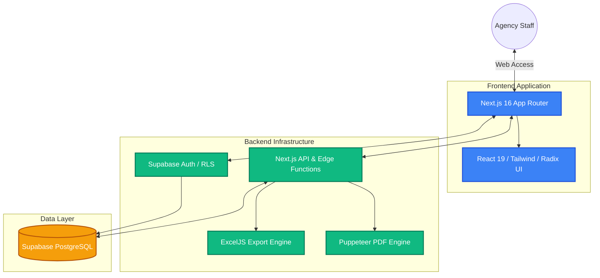
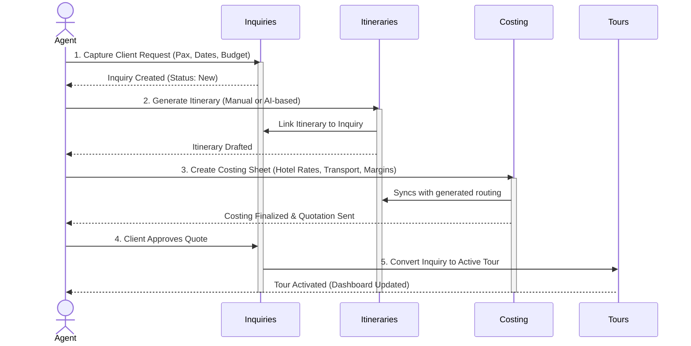
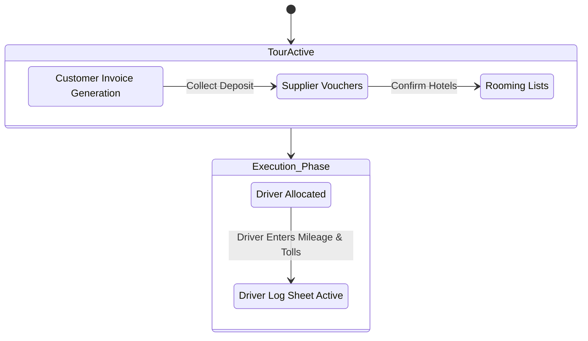
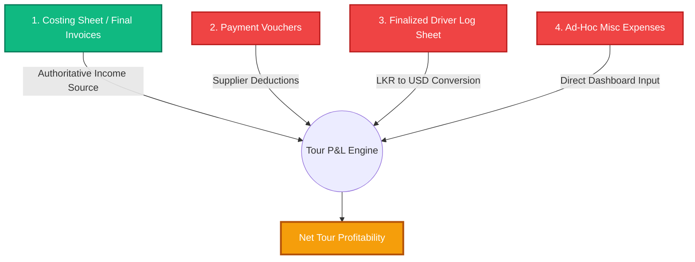

# TripSuite - Comprehensive Solution Architecture & Process Flow

## 1. Executive Summary
TripSuite (formerly Serendia) is an advanced, 360° Travel Agency Management System built to orchestrate the end-to-end lifecycle of a travel agency's operations. The platform seamlessly bridges the gap between initial client acquisition, complex multi-day itinerary generation, on-ground logistical tracking, and final financial reconciliation. 

## 2. High-Level System Architecture

## 3. Inquiry-to-Tour Process Flow

This flow maps out how a raw inquiry is converted into a structured, confirmed tour with accurate financial backing.

### Module Breakdown
- **Inquiry Management (`/inquiries`)**: Standardizes client input. Supports individual or group travel parameters, prioritizing leads mathematically (Low, Medium, High, Urgent).
- **Itineraries (`/itineraries`)**: Uses hotel rate data and POI mappings to craft dynamic, visually appealing itineraries.
- **Costing Sheet (`/costing-sheet`)**: The central financial calculator for the quotation phase. It pulls room rates, calculates vehicle mileage, and adds profit margins in real-time.

## 4. On-Ground Operations & Booking Flow

Once a Tour is active, the operations team ensures suppliers are booked and logistics are sorted.

### Module Breakdown
- **Customer Invoices (`/customer-invoices`)**: Validates the agreed total from the Costing Sheet. Supports multiple installments, manual subtotal adjustments, and PDF receipts.
- **Supplier Vouchers (`/vouchers`)**: Official communication dispatched to hotels and external service providers ensuring booked reservations. Decoupled from the costing sheet so ad-hoc changes can be made safely.
- **Rooming Lists (`/rooming-list`)**: Detailed breakdown of pax distribution per room (e.g., SGL, DBL, TWIN) tied tightly to specific hotel vouchers.
- **Driver Log Sheet (`/driver-log-sheet`)**: A crucial operational document used during the tour execution. Drivers record exact mileage, external fuel expenses, and tolls. Allows saving as Draft before strict finalization.

## 5. Profit & Loss (P&L) Reconciliation Flow

The P&L module acts as the financial ground-truth center. It isolates confirmed income and deducts all paid expenses.

### Execution Rules for P&L:
1. **Income Priority:** The final agreed amount on the *Costing Sheet* is treated as the primary income source. It falls back to invoices if there are specific overrides.
2. **Double-Count Prevention:** Once a driver Log Sheet is finalized, the P&L engine intelligently ignores any generic transport estimates inside payment vouchers, relying solely on the real-world LKR ground truth (converted to USD).
3. **Ghost Record Isolation:** "Unknown" or untracked vouchers are inherently stripped out from individual Tour P&L to ensure an agent's individual profitability metrics are protected from generic admin overheads.

## 6. Access Control & Admin Privileges

Operational integrity is preserved by restricting destructive or overriding actions:
- **Admin PIN Modals:** Sensitive actions, such as un-finalizing a driver's log sheet, force-editing an old P&L, or updating locked vouchers, require a secondary Admin PIN challenge.
- **RLS (Row Level Security):** All Supabase queries ensure a user can only alter entities within their established permission boundaries.
